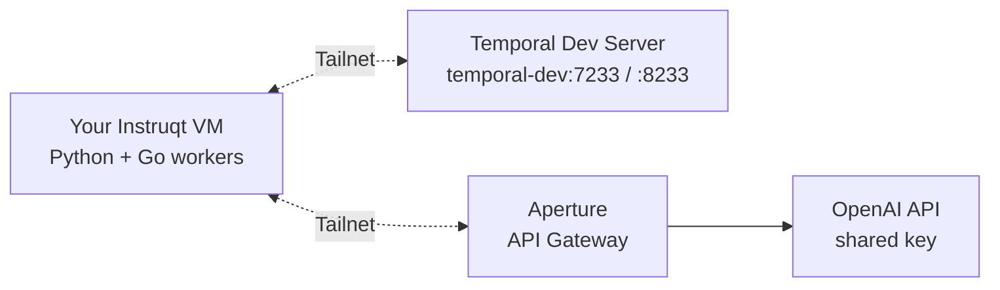

# Securing AI Applications with Tailscale and Temporal

Workshop materials for the joint Tailscale + Temporal session at **Replay 2026**.

## What you'll build

A durable AI weather agent powered by Temporal, secured by Tailscale:

- **Temporal** orchestrates an agentic loop where an LLM autonomously chains tool calls
- **Tailscale** provides zero-config encrypted networking between your VM and the shared infrastructure
- **Aperture** proxies LLM calls with rate limiting and shared key management. No OpenAI key needed on your VM



## Prerequisites

Your Instruqt VM comes pre-configured with everything you need:

- Python 3.13 and `uv`
- Go 1.26+
- Tailscale, already connected to the workshop tailnet
- Workshop code cloned, dependencies installed

## Quick start

Verify your environment:

```bash
uv run scripts/verify_setup.py
```

Then start with [Exercise 1](exercises/01_hello_tailnet/README.md).

## Exercises

| # | Exercise | Time | Description |
|---|----------|------|-------------|
| 1 | [Hello Tailnet](exercises/01_hello_tailnet/README.md) | 15 min | Run a geo-IP workflow on the shared Temporal server via Tailscale |
| 2 | [Explore Tailscale](exercises/02_explore_tailscale/README.md) | 15 min | Discover your network, understand Aperture, run a Go worker over `tsnet` |
| 3 | [Weather Agent](exercises/03_weather_agent/README.md) | 25 min | Build a durable AI agent with LLM calls routed through Aperture |
| 4 | [Go Agent](exercises/04_go_agent/README.md) | Stretch | Same agent pattern in Go (take-home challenge) |

## Temporal Web UI

Once your VM is on the tailnet, open the shared Temporal Web UI:

```
http://temporal-dev:8233
```

You'll see everyone's workflows running on the shared server.

## Resources

- [temporal-ts-net](https://github.com/temporal-community/temporal-ts-net) - Temporal CLI extension for Tailscale
- [Temporal Python SDK](https://docs.temporal.io/develop/python)
- [Temporal Go SDK](https://docs.temporal.io/develop/go)
- [Tailscale docs](https://tailscale.com/kb)
- [Aperture docs](https://docs.tailscale.com/aperture)

---

### Running this workshop yourself?

This repo is also a community asset. If you want to teach the session, run it locally, or remix the stack, see the [**community guide**](https://temporal-community.github.io/workshop-tailscale-replay-2026/) for instructor walkthroughs (with and without Instruqt), infrastructure setup, and architecture deep-dives.
