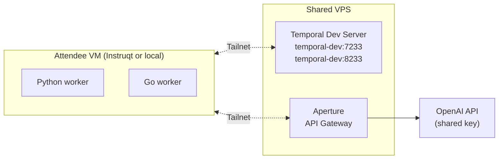
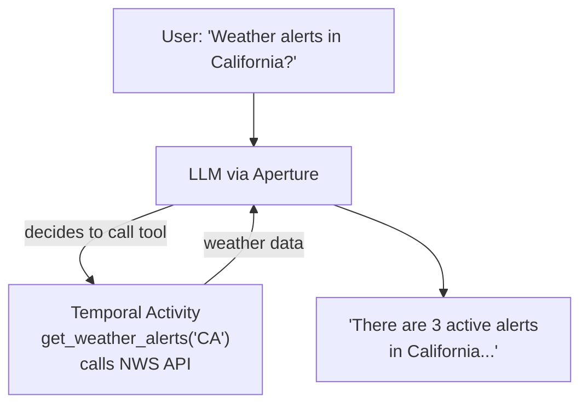
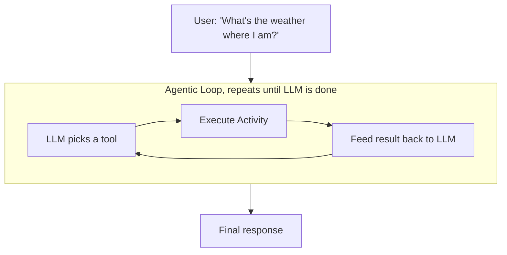
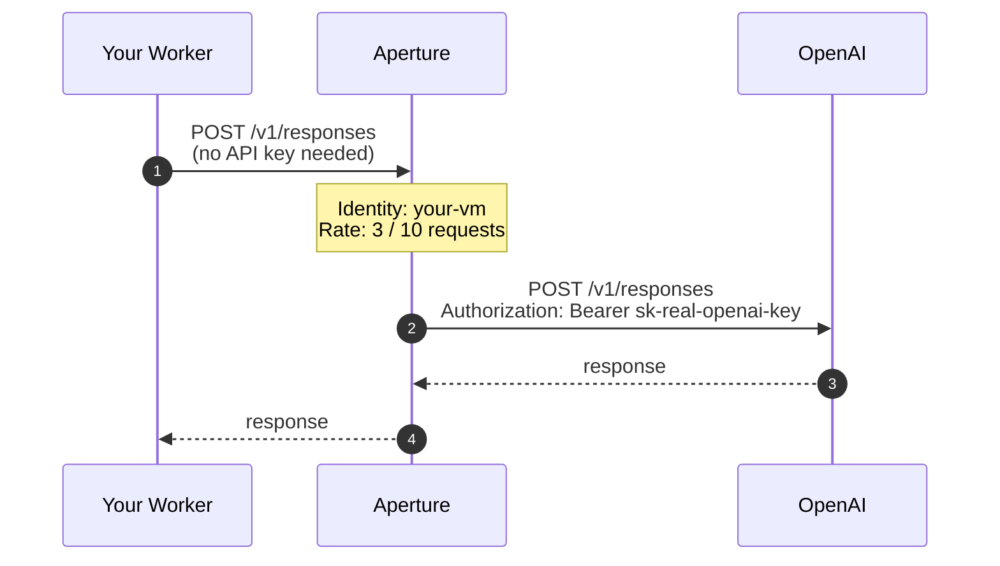

# Architecture

Three layers, one workshop.

## Topology

Everything between the attendee machine and the shared infrastructure rides on an encrypted Tailscale mesh. There is no public port open on the VPS. If you're not on the tailnet, you can't reach it.

## The four pieces

### Temporal (durability)

A workflow orchestrator. The workshop uses a single `AgentWorkflow` that calls an Activity, feeds the result back to the LLM, and loops until the LLM is satisfied. Every tool invocation is its own Activity with its own retry policy. If the worker dies mid-reasoning, the workflow picks up exactly where it left off.

### Tailscale (networking)

A mesh VPN built on WireGuard. Every workshop VM joins one tailnet and can reach `temporal-dev:7233` and `http://ai` as if they were on a local network, with no port forwarding, no firewall rules, and no VPN concentrator.

### `temporal-ts-net` (the glue)

A Temporal CLI extension that runs the dev server and joins the tailnet via [tsnet](https://pkg.go.dev/tailscale.com/tsnet). Six lines of Go wrap `temporal server start-dev` and put it on the network under a memorable hostname. Installed on the shared VPS; the workshop consumes the hostname it exposes. Source: [temporal-community/temporal-ts-net](https://github.com/temporal-community/temporal-ts-net).

### Aperture (API gateway)

Sits between attendee code and OpenAI. Holds the real API key, forwards requests to `api.openai.com`, and enforces per-identity rate limits using the caller's Tailscale identity. Attendees never see the key, and one person running 500 agents can't burn the whole budget.

## The two agent patterns

### Tool-calling (Exercise 3, Part 1)

One decision, one tool, one formatted response. Useful on its own (for example, "answer questions about our API docs") and a stepping stone to the loop.

### Agentic loop (Exercise 3, Part 2)

The LLM reasons through multiple steps on its own. The workshop's weather agent chains `get_ip_address`, `get_location_info`, `get_weather_alerts` with no hand-coded flow control; each tool is dynamically dispatched based on what the LLM asks for.

## Aperture in the middle

Two things to notice:

1. The attendee never has the real key. They POST to `http://ai/v1/responses` with no Authorization header, and Aperture swaps in the real credential on the way out.
2. Aperture uses the **caller's Tailscale identity** as the rate-limit key. No extra auth tokens, no per-attendee secrets to distribute. Whoever the tailnet says you are, that's who Aperture bills.

## Why this stack

Each piece removes a category of operational pain:

- **Temporal** turns "my agent crashed halfway through reasoning" from a lost conversation into a resumed one.
- **Tailscale** deletes VPN and firewall setup from the attendee onboarding path.
- **`temporal-ts-net`** means the shared Temporal server is a hostname, not an IP:port behind a load balancer.
- **Aperture** means one OpenAI key can serve 50 people without any of them seeing it, and without one person draining the budget.

Remove any one of those and the workshop gets substantially harder to run.
