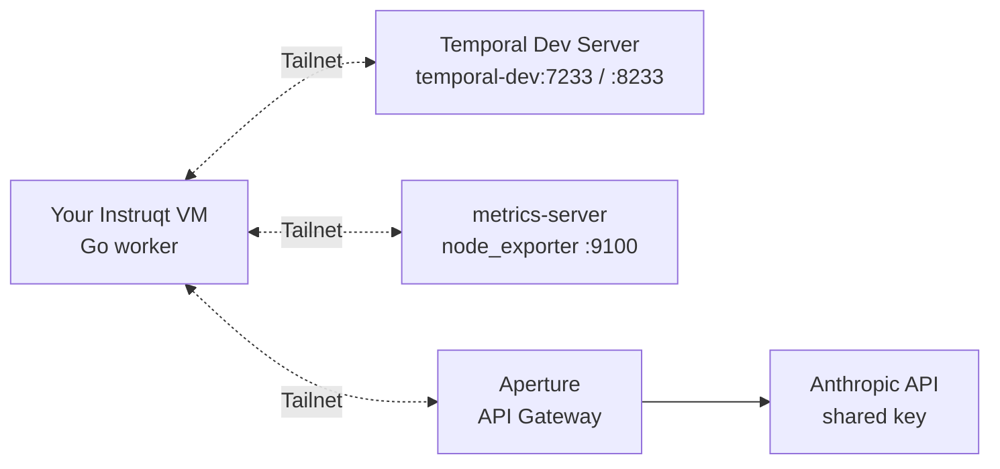

# Exercise 4: Metrics Watcher

A finished Go worker that joins the tailnet via `tsnet`, scrapes
`node_exporter` metrics from a pre-provisioned VM, and
asks Claude (via Aperture) for a plain-English health summary on a
schedule.

## Goal

Run the Exercise 2 `tsnet` pattern against a quick, real-world use-case: pull
`node_exporter` metrics off the tailnet, summarize them with Claude
via Aperture, and schedule the whole thing with Temporal. The code is
complete. Run it, and watch the runs in the Temporal UI.

## Background

### Topology



### What's different from Exercise 2

- **Temporal Schedule** with `TriggerImmediately`: fires once on start, then every `HEALTH_CHECK_INTERVAL` (default `10m`). Durable on the server.
- Data comes from another tailnet node (`metrics-server:9100`), not the public internet.
- LLM call goes to **Claude via Aperture**: same gateway as Exercise 3, different LLM backend.
- Returns a `HealthReport` as the workflow result based on the LLM's interpretation of the metrics.

### What's already built for you

- `main.go`: joins the tailnet via `tsnet`, dials Temporal, creates the Schedule.
- `activities.go`: `FetchMetrics` and `AnalyzeMetrics` (returns `HealthReport`).
- `workflow.go`: `HealthCheckWorkflow` chains the two activities.

## Run it

### Step 1: Go to the practice directory

```bash
cd exercises/04_go_agent/practice
go mod download
```

### Step 2: Start the worker

```bash
WORKSHOP_USER_ID=$WORKSHOP_USER_ID \
TS_AUTHKEY=tskey-auth-<your-key> \
METRICS_URL=http://metrics-server:9100/metrics \
go run .
```

First run takes 10-30 seconds while `tsnet` registers the node. After that:

```
level=INFO msg="joined tailnet" hostname=<you>-ex4-metrics-worker-<5 random chars> userID=<you>
level=INFO msg="connected to temporal" host=temporal-dev:7233
level=INFO msg="metrics reachable" url=http://metrics-server:9100/metrics
level=INFO msg="created schedule" id=<you>-health-check-schedule interval=10m0s workflow=<you>-health-check
```

The 5-char suffix on the hostname is generated once on first run and persisted via the tsnet state dir. On subsequent runs it's reused, so you re-register as the same node on the tailnet. Two attendees with the same `WORKSHOP_USER_ID` get different suffixes.

The schedule fires immediately. You'll see a completed workflow in the Temporal UI within seconds.

### Step 3: Watch it in the Temporal UI

Open `http://temporal-dev:8233`. Two places to look:

- **Schedules**: click `<you>-health-check-schedule` to see the interval, next fire time, and recent fires.
- **Workflows**: search for `<you>-health-check`. Each completed row (ID is suffixed with the schedule fire time) has the `HealthReport` in its Result panel.

### Step 4: Tune the cadence

10m is too slow to watch during the workshop. Stop the worker with `Ctrl+C`, then restart with a shorter interval:

```bash
HEALTH_CHECK_INTERVAL=2m \
WORKSHOP_USER_ID=$WORKSHOP_USER_ID \
TS_AUTHKEY=tskey-auth-<your-key> \
METRICS_URL=http://metrics-server:9100/metrics \
go run .
```

Any Go duration (`30s`, `5m`, `1h`). The worker recreates the schedule on startup, so restarting just takes effect.

### Step 5: Customize the Claude prompt

Open `activities.go`, find `AnalyzeMetrics`. Change the prompt: request a different field, flag anything unusual, whatever. Restart the worker and watch the `HealthReport` change on the next fire.

## Environment variables

| Variable                | Required | Default               | Description                                                          |
|-------------------------|----------|-----------------------|----------------------------------------------------------------------|
| `WORKSHOP_USER_ID`      | yes      | (none)                | Prefixes hostname, task queue, schedule ID, and workflow ID.         |
| `TS_AUTHKEY`            | yes*     | (none)                | Tailscale auth key. Required on first run; tsnet reuses state after. |
| `METRICS_URL`           | yes      | (none)                | `node_exporter` endpoint on the tailnet.                             |
| `HEALTH_CHECK_INTERVAL` | no       | `10m`                 | Cadence as a Go duration (`30s`, `5m`, `1h`).                        |
| `TEMPORAL_HOST`         | no       | `temporal-dev:7233`   | Temporal server address.                                             |
| `APERTURE_URL`          | no       | `http://ai`           | Aperture endpoint; Anthropic SDK appends `/v1/messages` automatically.|
| `AI_MODEL`              | no       | `claude-haiku-4-5`    | Claude model.                                                        |

`*` = required on first run only; the `tsnet` state dir persists the node key.

## What You've Learned

- `tsnet.Dial` works for both tailnet-internal HTTP and gRPC calls
- Aperture supports multiple LLM backends: Anthropic here, OpenAI in Exercise 3
- Temporal Schedules with `TriggerImmediately` fire now, then every N, with the next fire visible in the UI
- All three backing services are tailnet-only; Tailscale identity is the auth layer
