# Securing AI Applications with Tailscale and Temporal

## Replay 2026 Workshop

<br>

**Mason Egger**, Temporal<br>
**Kartik Bharath**, Tailscale

<!--
Welcome everyone! Over the next 90 minutes you'll build and run a durable AI agent
that's secured end-to-end by Tailscale networking.
-->

---
layout: two-cols
---

# About Us

### Mason Egger
Senior Solutions Architect, **Temporal**

"On my business card I am a Solutions Architect. In
my mind I am a programmer. But in my heart I am a
teacher."

PSF Fellow. President of the PyTexas Foundation.

::right::

<br><br>

### Kartik Bharath
*[Title]*, **Tailscale**

*[Kartik bio]*

<!--
Quick intros. We'll keep it brief since we have a lot to build today.
-->

---

# What You'll Learn Today

<br>

1. Put a Temporal dev server on a tailnet so workers, starters, and the Web UI are reachable across machines, no VPN, firewall rules, or port forwarding.
2. Use one config file to point workers at local, remote, or tailnet Temporal servers, with nothing hardcoded.
3. Route calls to a shared API key through a gateway that rate-limits by Tailscale identity, so nobody sees the key and nobody burns the budget.
4. Wrap an agent loop in a Temporal workflow so it survives crashes, retries, and rate limits, then run the same pattern in Python and Go.

---

# The Problem

AI applications in production need more than just "call the LLM":

<v-clicks>

- **Durability** - What happens when your agent crashes mid-reasoning?
- **Networking** - How do distributed workers reach your infrastructure securely?
- **API Security** - How do you share expensive API keys without exposing them?
- **Rate Limiting** - How do you prevent one user from burning your entire budget?

</v-clicks>

<br>

<v-click>

Today we solve all four.

</v-click>

---
layout: toc
current: arch
---

---
layout: section
---

# Architecture

---

# Architecture Overview

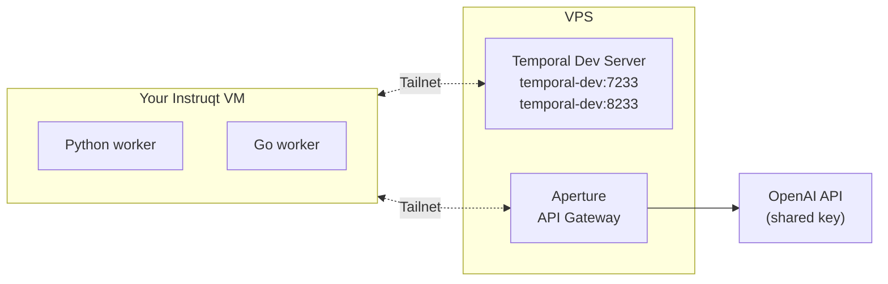

<v-clicks>

- **Tailscale** - encrypted mesh network, zero config
- **Aperture** - API gateway with identity-based rate limiting
- **temporal-ts-net** - Temporal dev server exposed on the tailnet

</v-clicks>

---

# What is Tailscale?

<v-clicks>

- **Mesh VPN** built on WireGuard - every device connects directly
- **Zero config** - no firewall rules, no port forwarding, no VPN concentrators
- **Identity-based** - every connection knows who's on the other end
- **Tailnet** - your private network of devices

</v-clicks>

<br>

<v-click>

Your Instruqt VM is already connected. The shared Temporal server is just `temporal-dev:7233`, as if it were on your local network.

</v-click>

---
layout: section
---

# It's too easy to put private things on the public internet.

---
layout: two-cols
---

# So you hide it behind a VPN

<br>

<v-clicks>

- Centralized hubs become bottlenecks
- Switching VPNs per region, dropped connections
- Broad access grants that never scale back
- Agents break the "everything in one place" assumption

</v-clicks>

::right::

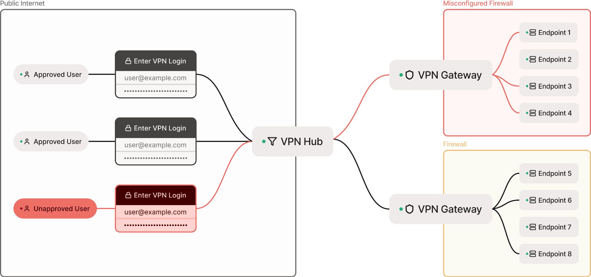

---

# Tailscale moves identity down the stack

Most networking tools push identity up to **Layer 7** (the application) or **Layer 5** (the session).

Tailscale brings identity and **WireGuard** all the way down to **Layer 3 — the network itself**.

<br>

<v-clicks>

- Connections authenticate **before** they happen
- Every device has a network identity, not just an IP
- Access policies are defined in code: per user, per group, per service
- If one device is compromised, the blast radius is tiny

</v-clicks>

---
layout: two-cols
---

# Everything connects on one network

Once devices join the tailnet, nodes reach each other directly over encrypted WireGuard.

<v-clicks>

- No central choke point, no concentrators
- Every node is both client and server
- Access follows identity, device, and policy

</v-clicks>

::right::

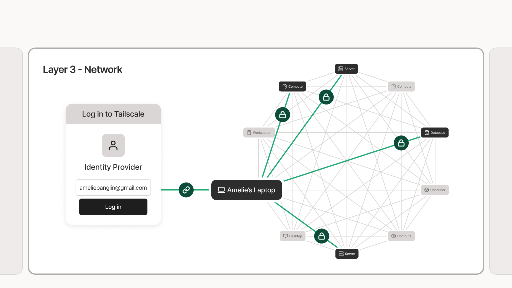

---

# What is Aperture?

<v-clicks>

- **API gateway** that sits between your code and external APIs
- **Shared key management** - one OpenAI key, many users, nobody sees the key
- **Identity-aware** - uses your Tailscale identity, no extra auth tokens
- **Rate limiting** - per-user quotas so no one burns the whole budget

</v-clicks>

<br>

<v-click>

Your LLM calls go to Aperture's endpoint instead of `api.openai.com`. Aperture forwards them with the real key and tracks your usage.

</v-click>

---
layout: two-cols
---

# Aperture by Tailscale

A **centralized gateway** for your AI tools. No API keys in developer hands.

<v-clicks>

- Identity-based access in front of every model
- One pane of glass across Claude Code, Codex, agents
- Policy you can audit, version, and enforce

</v-clicks>

::right::

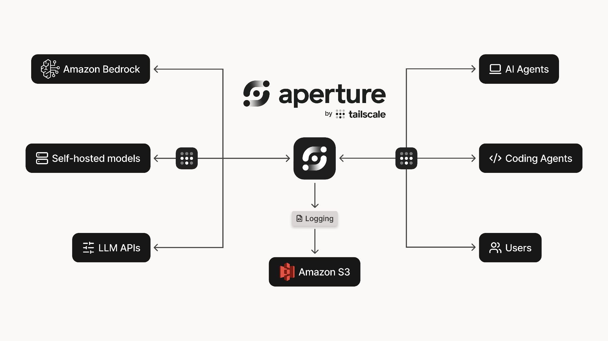

---

# Every AI call, cryptographically attributed

You can't secure what you can't see.

<br>

<v-clicks>

- Every request leaves a cryptographically verified trail
- Real-time token usage, model spend, and per-user attribution
- Session-level logs for debugging, tracing, and forensics
- Enforce guardrails across MCP and non-MCP tool calls

</v-clicks>

---

# Why embed Tailscale into applications?

<v-clicks>

- **Network identity for the app itself** — not just the machine it runs on
- **Reach it over the tailnet** without exposing it publicly
- **Decouple app access** from host-level network setup

</v-clicks>

<v-click>

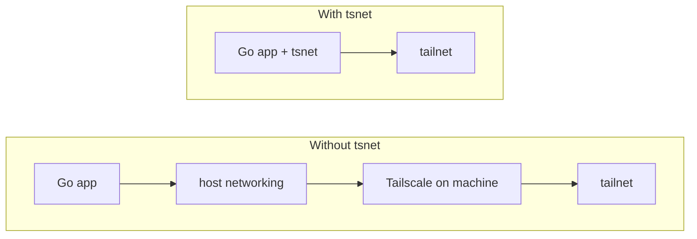

</v-click>

<v-click>

`tsnet` moves the network boundary from **machine to application**.

</v-click>

---
layout: two-cols
---

# tsnet vs host-level Tailscale

### Host-level Tailscale

- The **machine** joins the tailnet
- All apps on the box inherit its connectivity
- Best when one host identity is enough

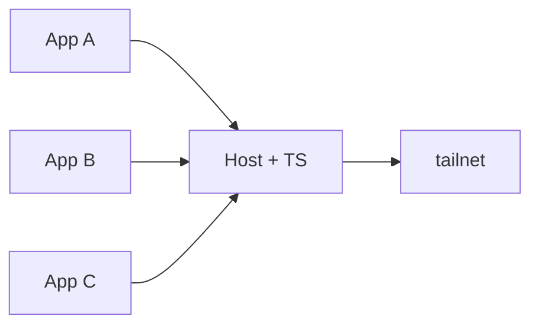

::right::

### `tsnet`

- A Go app joins the tailnet **directly**
- Each app has its own identity + policy boundary
- Best when the service is its own network citizen

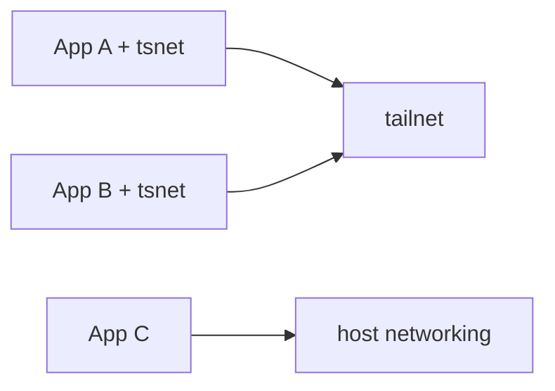

---
layout: two-cols
---

# From `start-dev` to `ts-net`

Normally you run a local Temporal dev server with the Temporal CLI:

```bash
temporal server start-dev
```

That gives you:

- `localhost:7233` gRPC
- `localhost:8233` Web UI

Only the machine running it can reach it.

::right::

<br>

We built a CLI **extension** that wraps the same dev server in tsnet:

```bash
temporal ts-net
```

That gives you:

- `temporal-dev:7233` on the tailnet
- `temporal-dev:8233` on the tailnet

Anyone on the tailnet can reach it, nobody else can.

---

# temporal-ts-net

How the workshop server is running right now:

```bash
temporal ts-net
```

<v-clicks>

- **Temporal CLI extension** - wraps `temporal server start-dev` and joins it to the tailnet
- **No public exposure** - the server is only reachable via Tailscale
- **gRPC + Web UI on the tailnet** - `temporal-dev:7233` and `temporal-dev:8233`
- **Open source** - [github.com/temporal-community/temporal-ts-net](https://github.com/temporal-community/temporal-ts-net)

</v-clicks>

---

# Workshop Environment

Your Exercise Environment already has these exported for you.

<div class="compact-table">

| Variable | What it's for | Used in |
|---|---|---|
| `WORKSHOP_USER_ID` | Your name, from sign-up. Goes into Workflow IDs, task queues, tsnet hostnames | 1, 2, 3, 4 |
| `TS_AUTHKEY` | Tailscale auth key for joining the tailnet | 1, 2, 4 |
| `TEMPORAL_CONFIG_FILE` | Points the Python SDK at `temporal.toml` | 1, 3 |
| `APERTURE_URL` | Base URL for the shared LLM gateway | 3, 4 |

</div>

<style>
.compact-table :deep(td),
.compact-table :deep(th) {
  padding: 0.4rem 0.65rem;
  font-size: 1.25rem;
}
</style>

---

# `practice/` and `solution/`

Every exercise directory follows the same layout:

<v-clicks>

- **`practice/`** - where you work. Files contain **TODO** comments pointing at the change you need to make.
- **`solution/`** - finished version. Reference if you get stuck, don't run from here.

</v-clicks>

---
layout: toc
current: ex1
---

---
layout: section
---

# Exercise 1: Hello Tailnet

---

# Exercise 1: What You'll Do

### Goal
Prove the tailnet works. Run a workflow on the shared Temporal server.

### Steps

1. **Join the tailnet** -> `tailscale up --auth-key="$TS_AUTHKEY"`
2. **Point your Client at the `tailnet` profile** in `temporal.toml`
3. **Add your user ID** to the workflow ID
4. **Start a worker** -> it connects to `temporal-dev:7233`
5. **Run the workflow** -> get your IP and geolocation
6. **Open the Temporal UI** -> find your workflow among everyone else's

---

# Temporal Environment Configuration

Keep connection settings in a **config file**, not your code:

```toml
# temporal.toml (TEMPORAL_CONFIG_FILE points the SDK here)

[profile.default]
address = "localhost:7233"
namespace = "default"

[profile.tailnet]
address = "temporal-dev:7233"
namespace = "default"
```

---

# Picking a Profile in Code

```python
config = ClientConfig.load_client_connect_config(profile="tailnet")
client = await Client.connect(**config)
```

<v-click>

Same worker and starter code works locally (`default`), on the workshop tailnet (`tailnet`), or in prod. Swap a profile, not your code.

</v-click>

---

# Tailscale Commands

Two commands drive the Tailscale client on any machine:

```bash
tailscale up
```

```bash
tailscale down
```

<v-clicks>

- **`--auth-key`** - non-interactive auth. Without it, `up` opens a browser for SSO.
- **`--hostname`** - what this node shows up as in `tailscale status` and `whois`. Uniqueness matters on a shared tailnet.
- **`tailscale down`** - leaves the tailnet. The node stays registered; a future `up` reuses its identity.

</v-clicks>

---
layout: exercise
heading: Exercise 1
minutes: 15
---

Join the tailnet, point the Client at the `tailnet` profile, and run the geo-IP workflow.

Open the Temporal UI and find your workflow among everyone else's.

---

# What Just Happened in Exercise 1

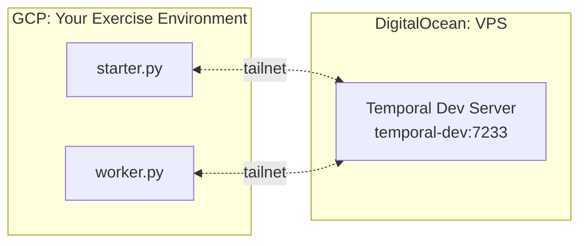

<v-clicks>

- Two clouds, one Workflow, only a `tailnet` between them
- The Temporal Server was never exposed to the public internet, yet your Worker reached it like a local service
- Your Workflow ID carried your name so you could find your run among every attendee's in the shared UI

</v-clicks>

---
layout: toc
current: ex2
---

---
layout: section
---

# Exercise 2: Explore Tailscale

---

# Exercise 2: What You'll Do

### Part 1: Explore the tailnet from the CLI
- `tailscale status` -> every node you can reach
- `tailscale ping temporal-dev` -> direct WireGuard vs. DERP relay
- `tailscale whois` -> your identity on the tailnet

### Part 2: Embed the tailnet in a Go worker
Take the system Tailscale client offline, then run a worker that puts **itself** on the tailnet via `tsnet`. The worker becomes a first-class tailnet node, not a client of one.

---

# What the Go Worker Does in Ex2

Two small changes in `main.go` put the worker process on the tailnet and route Temporal traffic through it.

<br>

<v-clicks>

1. **Configure a `tsnet.Server`** with a hostname, a state directory, and `TS_AUTHKEY`. When it starts, the process has its own tailnet IP.
2. **Plug `tsNode.Dial` into the Temporal gRPC client** via `grpc.WithContextDialer`. Every byte the SDK sends flows over the tailnet.

</v-clicks>

<br>

<v-click>

No host-level Tailscale required. No network plumbing. The worker *is* a tailnet node.

</v-click>

---
layout: exercise
heading: Exercise 2
minutes: 15
---

Explore the tailnet from the CLI, then fill in the two TODOs in `main.go` so the Go worker joins the tailnet on its own and dials Temporal through it.

---

# What Just Happened in Exercise 2

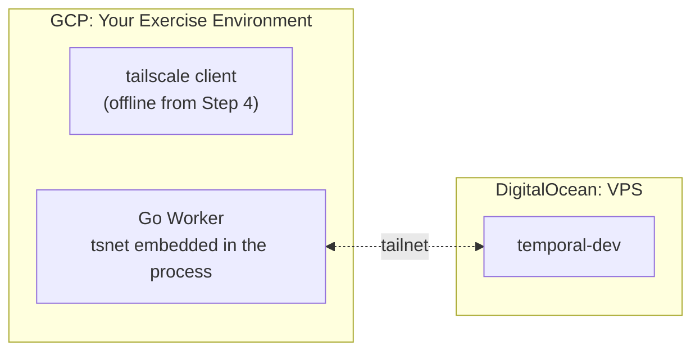

<v-clicks>

- The system `tailscale` binary was off the whole time your Worker ran
- The Go Worker carried its own `tsnet` node inside the process and joined the `tailnet` itself
- Temporal's gRPC calls routed through `tsNode.Dial` via `grpc.WithContextDialer`
- Your Worker is now a first-class `tailnet` node, not a client of one

</v-clicks>

---
layout: toc
current: agents
---

---
layout: section
---

# AI Agents on Temporal

---

# The Tool-Calling Pattern

A single LLM decision: should I use a tool?

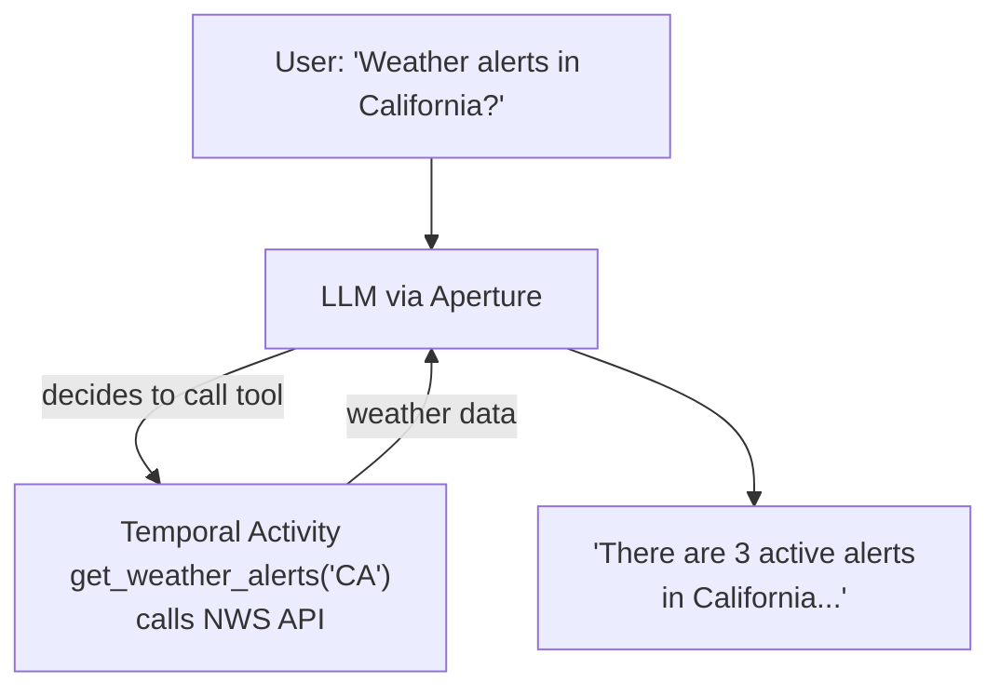

<v-click>

One LLM call decides, one activity executes, one final LLM call formats. Simple.

</v-click>

---

# The Agentic Loop Pattern

The LLM reasons through **multiple steps** autonomously:

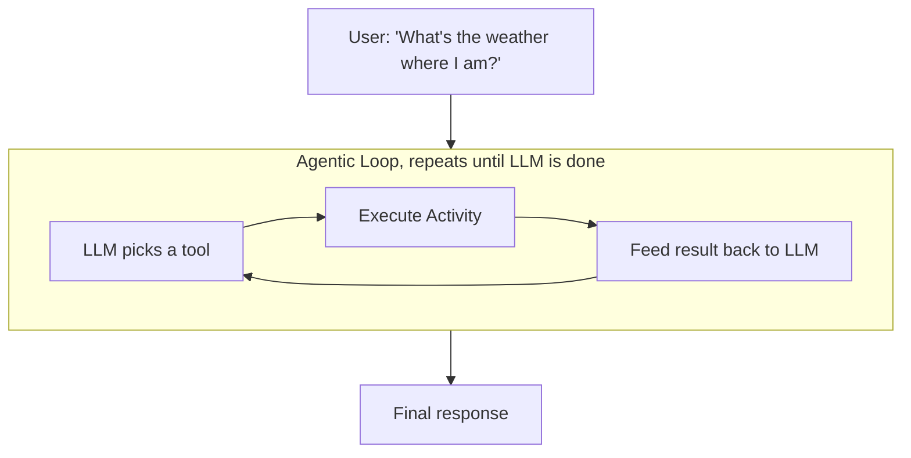

<v-click>

`get_ip_address` -> `get_location_info` -> `get_weather_alerts` -> respond

</v-click>

---

# Why This Needs Temporal

<v-clicks>

- **Each tool call is an Activity** - retried automatically on failure
- **The loop is a Workflow** - survives worker crashes, resumes from last completed step
- **Dynamic Activities** - the LLM picks the tool name, Temporal executes it
- **Durable state** - the entire conversation history is preserved

</v-clicks>

<br>

<v-click>

```python
# The LLM chose "get_ip_address", Temporal runs it
tool_result = await workflow.execute_activity(
    item.name,  # dynamic, chosen by the LLM
    args,
    start_to_close_timeout=timedelta(seconds=30),
)
```

</v-click>

---

# How Aperture Secures Your LLM Calls

<!-- KARTIK: Replace this slide with your Aperture content -->

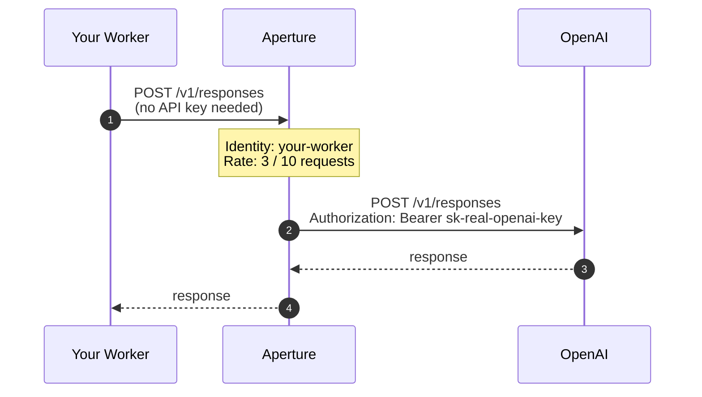

---

# How Aperture Fits the Agent

Every `create` activity call goes through Aperture:

```python
@activity.defn
async def create(request: OpenAIResponsesRequest) -> Response:
    client = AsyncOpenAI(
        max_retries=0,
        base_url=f"{os.getenv('APERTURE_URL')}/v1",
        api_key="",  # Aperture ignores this; identity = Tailscale
    )
    return await client.responses.create(...)
```

<v-click>

Tool activities (weather, IP, location) call **free public APIs** directly. Only the LLM calls need Aperture.

</v-click>

---
layout: toc
current: ex3
---

---
layout: section
---

# Exercise 3: Weather Agent

---

# Exercise 3: TODO 1

**Route LLM calls through Aperture.** In `activities.py`, add `base_url` to the OpenAI client:

```python
client = AsyncOpenAI(
    max_retries=0,
    base_url=f"{os.getenv('APERTURE_URL')}/v1",
    api_key="",
)
```

Then run the **tool-calling workflow**:

```bash
uv run worker.py                                     # Terminal 1
uv run starter.py "Weather alerts in California?"    # Terminal 2
```

---

# Exercise 3: TODOs 2 and 3

<br>

2. **Turn on the loop.** In `agent_workflow.py`, change `False` to `True`:

    ```python
    while True:  # was: while False
    ```

3. **Execute the dynamic activity.** Wire up the tool execution in the same file:

    ```python
    tool_result = await workflow.execute_activity(
        item.name,
        args,
        start_to_close_timeout=timedelta(seconds=30),
    )
    ```

---

# Exercise 3: Run the Agent

```bash
# Terminal 1 - start the agent worker
uv run worker.py --agent

# Terminal 2 - ask a question
uv run starter.py --agent "What's the weather like where I am?"
```

### What to watch for

- **Worker logs** - LLM chain: `get_ip_address` -> `get_location_info` -> `get_weather_alerts`
- **Temporal UI** - each tool call is a separate activity in the workflow history
- **The response** - a natural language answer with your local weather

---
layout: exercise
heading: Exercise 3
minutes: 15
---

Complete the 3 TODOs. Run the tool-calling workflow first, then enable the agentic loop.

Watch the multi-step reasoning in the Temporal UI.

---

# The Agent's Reasoning, Step by Step

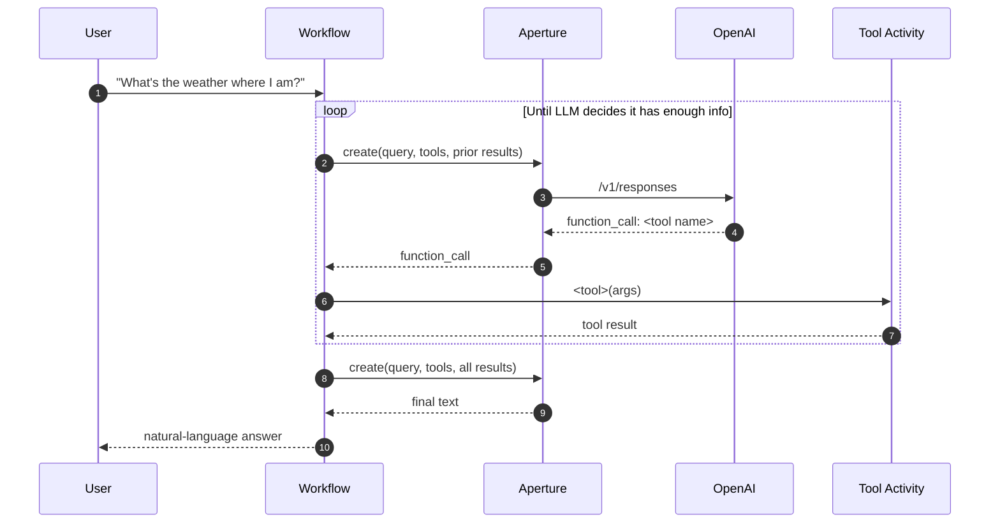

---

# The LLM's Decision, Durably Recorded

The agent's reasoning trace lives in Temporal's event history:

```
#5   ActivityTaskScheduled   activityType=create
#11  ActivityTaskScheduled   activityType=get_ip_address
#17  ActivityTaskScheduled   activityType=create
#23  ActivityTaskScheduled   activityType=get_location_info
#35  ActivityTaskScheduled   activityType=get_weather_alerts
#47  WorkflowExecutionCompleted
```

<v-clicks>

- Each `activityType` tells you which tool the LLM picked on that turn
- Every LLM call, every tool choice, every result is persisted
- Worker crash mid-loop? Replay resumes the agent where it left off

</v-clicks>

---

# "You Can't Build Agents on Temporal"

### The myth

> Workflow code has to be deterministic. An LLM picking the next tool at runtime is the opposite of deterministic. So you can't build AI agents on Temporal.

<v-click>

### What you just did

- The LLM picked `get_ip_address`, `get_location_info`, and `get_weather_alerts` at runtime
- None of those names were hard-coded in your Workflow
- Temporal ran them, recorded them, and would replay them on crash

</v-click>

---

# Why It Still Works

The Workflow stays deterministic because Temporal records the LLM's response as an activity result. On replay, the same result comes back and the same tool runs.

<br>

<v-click>

Read more: <a href="https://temporal.io/blog/of-course-you-can-build-dynamic-ai-agents-with-temporal">Of course you can build dynamic AI agents with Temporal</a>

</v-click>

---
layout: toc
current: ratelimit
---

---
layout: section
---

# Rate Limit Demo

---

# Let's All Fire at Once

<br>

Everyone run this at the same time:

```bash
cd exercises/03_weather_agent/practice
uv run starter.py --agent "What's the weather like where I am?"
```

<br>

<v-clicks>

- Watch the Aperture dashboard - per-user rate limits in action
- Some requests get throttled -> Temporal **retries** the activity automatically
- Nobody's workflow fails. Durability meets rate limiting.

</v-clicks>

<!-- KARTIK: Show the Aperture dashboard here -->

---
layout: toc
current: ex4
---

---
layout: section
---

# Exercise 4: Metrics Watcher

---

# Temporal Schedules

Run the same workflow on a cadence, durably, without a cron daemon.

<v-clicks>

- **Schedules live on the Temporal server**, not the worker. Restarting a worker doesn't touch them.
- **`TriggerImmediately`** fires one run at creation time, then resumes the interval.
- **`RemainingActions`** caps how many times the Schedule can fire before it pauses itself - a guardrail on a shared dev server.
- **Re-run the starter to change the cadence.** It deletes and recreates the Schedule; the worker keeps running.

</v-clicks>

---

# Ex4 Topology

The Go worker joins the tailnet once via `tsnet` and reaches three services over it.

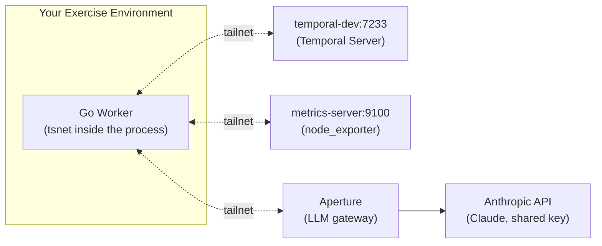

Same `tsnet` as Ex2, same Aperture as Ex3. Now with Claude, and a Temporal Schedule firing on a cadence.

---

# Exercise 4: What You'll Do

No TODOs this time. The code is done, read it, run it, tune it.

<v-clicks>

1. **Skim the code** - scavenger hunt for the interval default, Schedule cap, and activities.
2. **Start the Go worker** - joins tailnet, dials Temporal, pings metrics, waits for fires.
3. **Run the starter** - creates the Schedule with `TriggerImmediately` at `HEALTH_CHECK_INTERVAL=1m`.
4. **Watch in the Temporal UI** - Schedules tab shows fires; each run's Result is a Claude `HealthReport`.
5. **Tune the cadence** - re-run the starter with a new interval. Worker keeps running.

</v-clicks>

---
layout: exercise
heading: Exercise 4
minutes: 15
---

Run the finished metrics watcher. Watch the Schedule fire. Tune the interval. Optionally, edit the Claude prompt and see the `HealthReport` change on the next fire.

---
layout: toc
current: wrap
---

---
layout: section
---

# Wrap-Up

---

# What We Built

<div class="compact-table">

| Layer | Technology | What It Does |
|-------|-----------|--------------|
| **Durability** | Temporal | Workflows, Schedules, retries, crash recovery |
| **Networking** | Tailscale + tsnet | Zero-config encrypted mesh, server + worker side |
| **API Security** | Aperture | Shared keys, identity-based rate limits, model-agnostic |
| **AI** | OpenAI (Python) + Claude (Go) | Same gateway, two vendors, two languages |

</div>

<v-click>

No VPN setup. No API keys on your machine. No hardcoded addresses. Just a config file and a tailnet.

</v-click>

<style>
.compact-table :deep(td),
.compact-table :deep(th) {
  padding: 0.35rem 0.65rem;
  font-size: 1.25rem;
}
</style>

---

# Three Patterns to Take Home

<v-clicks>

### 1. Environment Configuration
Use `temporal.toml` profiles, not hardcoded addresses. Switch between local, staging, and production with one env var.

### 2. Aperture as API Gateway
Put expensive API keys behind a gateway with identity-based rate limiting. Your developers never see the key.

### 3. Durable AI Agents
Wrap your agentic loops in Temporal workflows. Every tool call is an activity. Every failure is a retry. Every crash is a resume.

</v-clicks>

---

# Resources

<div class="compact-table">

| Resource | Link |
|----------|------|
| Workshop repo | [github.com/temporal-community/workshop-tailscale-replay-2026](https://github.com/temporal-community/workshop-tailscale-replay-2026) |
| temporal-ts-net | [github.com/temporal-community/temporal-ts-net](https://github.com/temporal-community/temporal-ts-net) |
| Temporal Python SDK | [docs.temporal.io/develop/python](https://docs.temporal.io/develop/python) |
| Temporal Go SDK | [docs.temporal.io/develop/go](https://docs.temporal.io/develop/go) |
| Temporal envconfig | [docs.temporal.io/develop/environment-configuration](https://docs.temporal.io/develop/environment-configuration) |
| Tailscale docs | [tailscale.com/kb](https://tailscale.com/kb) |
| Aperture docs | [docs.tailscale.com/aperture](https://docs.tailscale.com/aperture) |

</div>

<style>
.compact-table :deep(td),
.compact-table :deep(th) {
  padding: 0.3rem 0.6rem;
  font-size: 1.2rem;
}
</style>

---
layout: end
---

# Questions?

**Mason Egger**, mason.egger@temporal.io

**Kartik Bharath**, *[email]*
