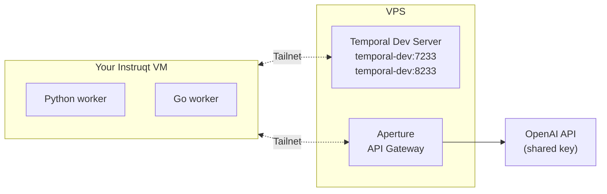
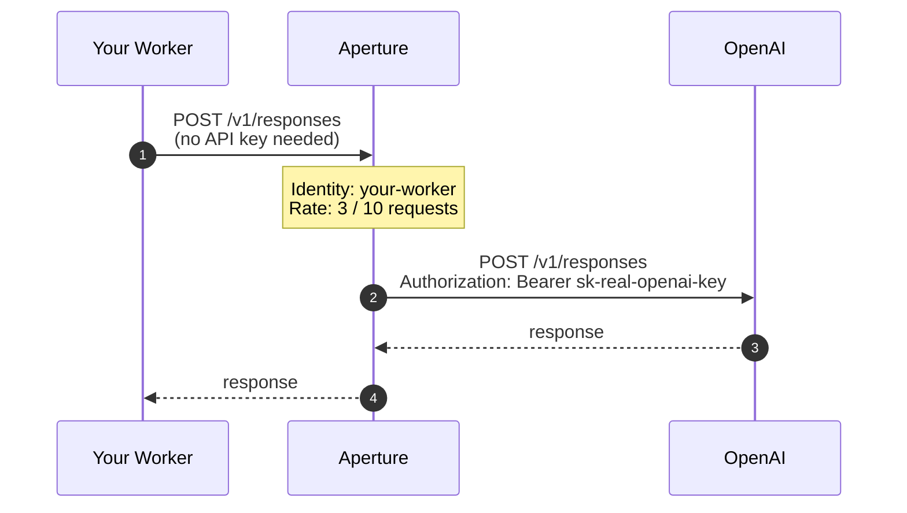
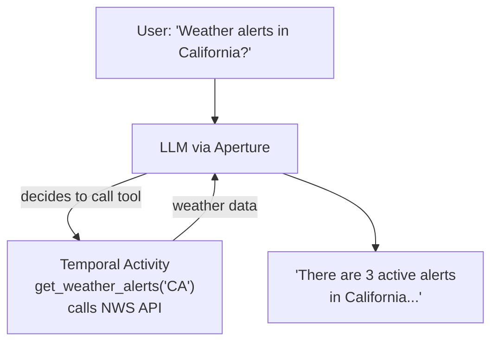
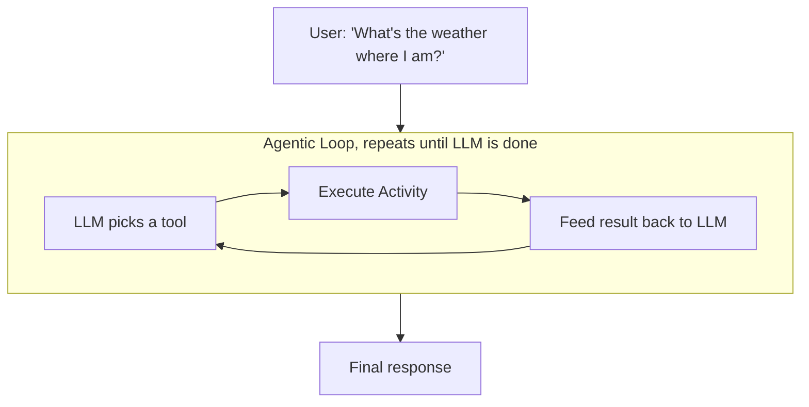

# Securing AI Applications with Tailscale and Temporal

## Replay 2026 Workshop

<br>

**Mason Egger**, Temporal<br>
**Kartik Bharath**, Tailscale

<!--
Welcome everyone! Over the next 90 minutes you'll build and run a durable AI agent
that's secured end-to-end by Tailscale networking.
-->

---
layout: two-cols
---

# About Us

### Mason Egger
Senior Solutions Architect, **Temporal**

"On my business card I am a Solutions Architect. In
my mind I am a programmer. But in my heart I am a
teacher."

PSF Fellow. President of the PyTexas Foundation.

::right::

<br><br>

### Kartik Bharath
*[Title]*, **Tailscale**

*[Kartik bio]*

<!--
Quick intros. We'll keep it brief since we have a lot to build today.
-->

---

# What You'll Learn Today

<br>

1. Put a Temporal dev server on a tailnet so workers, starters, and the Web UI are reachable across machines, no VPN, firewall rules, or port forwarding.
2. Use one config file to point workers at local, remote, or tailnet Temporal servers, with nothing hardcoded.
3. Route calls to a shared API key through a gateway that rate-limits by Tailscale identity, so nobody sees the key and nobody burns the budget.
4. Wrap an agent loop in a Temporal workflow so it survives crashes, retries, and rate limits, then run the same pattern in Python and Go.

---

# The Problem

AI applications in production need more than just "call the LLM":

<v-clicks>

- **Durability** - What happens when your agent crashes mid-reasoning?
- **Networking** - How do distributed workers reach your infrastructure securely?
- **API Security** - How do you share expensive API keys without exposing them?
- **Rate Limiting** - How do you prevent one user from burning your entire budget?

</v-clicks>

<br>

<v-click>

Today we solve all four.

</v-click>

---
layout: toc
current: arch
---

---
layout: section
---

# Architecture

---

# Architecture Overview



<v-clicks>

- **Tailscale** - encrypted mesh network, zero config
- **Aperture** - API gateway with identity-based rate limiting
- **temporal-ts-net** - Temporal dev server exposed on the tailnet

</v-clicks>

---

# What is Tailscale?

<v-clicks>

- **Mesh VPN** built on WireGuard - every device connects directly
- **Zero config** - no firewall rules, no port forwarding, no VPN concentrators
- **Identity-based** - every connection knows who's on the other end
- **Tailnet** - your private network of devices

</v-clicks>

<br>

<v-click>

Your Instruqt VM is already connected. The shared Temporal server is just `temporal-dev:7233`, as if it were on your local network.

</v-click>

---

# What is Aperture?

<v-clicks>

- **API gateway** that sits between your code and external APIs
- **Shared key management** - one OpenAI key, many users, nobody sees the key
- **Identity-aware** - uses your Tailscale identity, no extra auth tokens
- **Rate limiting** - per-user quotas so no one burns the whole budget

</v-clicks>

<br>

<v-click>

Your LLM calls go to Aperture's endpoint instead of `api.openai.com`. Aperture forwards them with the real key and tracks your usage.

</v-click>

---
layout: two-cols
---

# From `start-dev` to `ts-net`

Normally you run a local Temporal dev server with the Temporal CLI:

```bash
temporal server start-dev
```

That gives you:

- `localhost:7233` gRPC
- `localhost:8233` Web UI

Only the machine running it can reach it.

::right::

<br>

We built a CLI **extension** that wraps the same dev server in tsnet:

```bash
temporal ts-net
```

That gives you:

- `temporal-dev:7233` on the tailnet
- `temporal-dev:8233` on the tailnet

Anyone on the tailnet can reach it, nobody else can.

---

# temporal-ts-net

How the workshop server is running right now:

```bash
temporal ts-net \
    --db-filename /var/lib/temporal/workshop.db \
    --max-connections 500 \
    --connection-rate-limit 50
```

<v-clicks>

- **Temporal CLI extension** - runs `temporal server start-dev` and joins it to the tailnet
- **No public exposure** - the server is only reachable via Tailscale
- **Supports gRPC + Web UI** - `temporal-dev:7233` and `temporal-dev:8233`
- **Built with tsnet** - Go library for embedding Tailscale in applications

</v-clicks>

---
layout: toc
current: ex1
---

---
layout: section
---

# Exercise 1: Hello Tailnet

---

# Exercise 1: What You'll Do

<br>

### Goal
Prove the tailnet works. Run a workflow on the shared Temporal server.

<br>

### Steps

1. **Create `temporal.toml`** - configure the `tailnet` profile
2. **Add your user ID** to the workflow ID
3. **Start a worker** -> it connects to `temporal-dev:7233`
4. **Run the workflow** -> get your IP and geolocation
5. **Open the Temporal UI** -> see your workflow alongside everyone else's

---

# Temporal Environment Configuration

Instead of hardcoding addresses, use a **config file**:

```toml
# ~/.config/temporalio/temporal.toml

[profile.default]
address = "localhost:7233"
namespace = "default"

[profile.tailnet]
address = "temporal-dev:7233"
namespace = "default"
```

<br>

The SDK reads this automatically:

```python
config = ClientConfig.load_client_connect_config()
client = await Client.connect(**config)
```

<v-click>

Set `TEMPORAL_PROFILE=tailnet` and every worker, starter, and CLI command connects to the right server.

</v-click>

---

# Exercise 1: Commands

1. **Copy the config.**

    ```bash
    mkdir -p ~/.config/temporalio
    cp temporal.toml.example ~/.config/temporalio/temporal.toml
    ```

2. **Start the worker.**

    ```bash
    cd exercises/01_hello_tailnet/practice
    uv run worker.py
    ```

3. **Run the workflow.**

    ```bash
    cd exercises/01_hello_tailnet/practice
    uv run starter.py
    ```

4. **Check the UI** at **http://temporal-dev:8233**.

---
layout: exercise
heading: Exercise 1
minutes: 15
---

Create `temporal.toml`, add your user ID, run the geo-IP workflow.

Open the Temporal UI and find your workflow.

---
layout: toc
current: ex2
---

---
layout: section
---

# Exercise 2: Explore Tailscale

---

# Exercise 2: Your Tailscale Network

<br>

### Discover what's on the tailnet

```bash
tailscale status        # See all machines
tailscale ping temporal-dev   # Direct encrypted connection
tailscale whois $(tailscale ip -4)   # Your identity
```

<v-clicks>

- Your VM, the Temporal server, Aperture, and every other attendee
- Direct WireGuard connections - no relay servers
- Your identity is automatic - Aperture uses it for rate limiting

</v-clicks>

---

# How Aperture Secures Your LLM Calls

<!-- KARTIK: Replace this slide with your Aperture content -->



---
layout: exercise
heading: Exercise 2
minutes: 15
---

Explore your Tailscale network.

Run `tailscale status`, ping the server, check your identity.

---
layout: toc
current: agents
---

---
layout: section
---

# AI Agents on Temporal

---

# The Tool-Calling Pattern

A single LLM decision: should I use a tool?



<v-click>

One LLM call decides, one activity executes, one final LLM call formats. Simple.

</v-click>

---

# The Agentic Loop Pattern

The LLM reasons through **multiple steps** autonomously:



<v-click>

`get_ip_address` -> `get_location_info` -> `get_weather_alerts` -> respond

</v-click>

---

# Why This Needs Temporal

<v-clicks>

- **Each tool call is an Activity** - retried automatically on failure
- **The loop is a Workflow** - survives worker crashes, resumes from last completed step
- **Dynamic Activities** - the LLM picks the tool name, Temporal executes it
- **Durable state** - the entire conversation history is preserved

</v-clicks>

<br>

<v-click>

```python
# The LLM chose "get_ip_address", Temporal runs it
tool_result = await workflow.execute_activity(
    item.name,  # dynamic, chosen by the LLM
    args,
    start_to_close_timeout=timedelta(seconds=30),
)
```

</v-click>

---

# How Aperture Fits the Agent

Every `create` activity call goes through Aperture:

```python
@activity.defn
async def create(request: OpenAIResponsesRequest) -> Response:
    client = AsyncOpenAI(
        max_retries=0,
        base_url=os.getenv("OPENAI_BASE_URL"),  # Aperture endpoint
    )
    return await client.responses.create(
        model=request.model,
        instructions=request.instructions,
        input=request.input,
        tools=request.tools,
    )
```

<v-click>

The tool execution activities (weather, IP, location) call **free public APIs** directly. Only the LLM calls need Aperture.

</v-click>

---
layout: toc
current: ex3
---

---
layout: section
---

# Exercise 3: Weather Agent

---

# Exercise 3: TODO 1

<br>

1. **Route LLM calls through Aperture.** In `activities.py`, add `base_url` to the OpenAI client:

    ```python
    client = AsyncOpenAI(
        max_retries=0,
        base_url=os.getenv("OPENAI_BASE_URL"),
    )
    ```

<br>

Then run the **tool-calling workflow**:

```bash
uv run worker.py                    # Terminal 1
uv run starter.py "Weather alerts in California?"  # Terminal 2
```

---

# Exercise 3: TODOs 2 and 3

<br>

2. **Turn on the loop.** In `agent_workflow.py`, change `False` to `True`:

    ```python
    while True:  # was: while False
    ```

3. **Execute the dynamic activity.** Wire up the tool execution in the same file:

    ```python
    tool_result = await workflow.execute_activity(
        item.name,
        args,
        start_to_close_timeout=timedelta(seconds=30),
    )
    ```

---

# Exercise 3: Run the Agent

<br>

```bash
# Terminal 1 - start the agent worker
uv run worker.py --agent

# Terminal 2 - ask a question
uv run starter.py --agent "What's the weather like where I am?"
```

<br>

### What to watch for

- **Worker logs** - see the LLM chain: `get_ip_address` -> `get_location_info` -> `get_weather_alerts`
- **Temporal UI** - each tool call appears as a separate activity in the workflow history
- **The response** - a natural language answer with your local weather

---
layout: exercise
heading: Exercise 3
minutes: 15
---

Complete the 3 TODOs. Run the tool-calling workflow first, then enable the agentic loop.

Watch the multi-step reasoning in the Temporal UI.

---
layout: toc
current: ratelimit
---

---
layout: section
---

# Rate Limit Demo

---

# Let's All Fire at Once

<br>

Everyone run this at the same time:

```bash
cd exercises/03_weather_agent/practice
uv run starter.py --agent "What's the weather like where I am?"
```

<br>

<v-clicks>

- Watch the Aperture dashboard - per-user rate limits in action
- Some requests get throttled -> Temporal **retries** the activity automatically
- Nobody's workflow fails. Durability meets rate limiting.

</v-clicks>

<!-- KARTIK: Show the Aperture dashboard here -->

---
layout: toc
current: tsnet
---

---
layout: section
---

# temporal-ts-net and Go Agent

---

# How the Dev Server Got on the Tailnet

```go
// temporal-ts-net creates a tsnet.Server and proxies TCP connections
tsSrv := &tsnet.Server{
    Hostname: "temporal-dev",
    AuthKey:  os.Getenv("TS_AUTHKEY"),
}
tsSrv.Start()

// Listens on the tailnet, proxies to localhost:7233
listener, _ := tsSrv.Listen("tcp", ":7233")
for {
    conn, _ := listener.Accept()
    go proxy(conn, "localhost:7233")
}
```

<v-clicks>

- **6 lines** to put any TCP service on a Tailscale network
- Built as a **Temporal CLI extension** - `temporal ts-net`
- Supports rate limiting, max connections, idle timeouts
- Open source: [github.com/temporal-community/temporal-ts-net](https://github.com/temporal-community/temporal-ts-net)

</v-clicks>

---

# Exercise 4: Go Agent Preview

**Exercise 4.** Same weather agent, in Go.

```go
func AgentWorkflow(ctx workflow.Context, input string) (string, error) {
    for {
        // Call LLM through Aperture
        result := workflow.ExecuteActivity(ctx, CreateCompletion, ...)

        if result.Type == "function_call" {
            // Execute the tool the LLM chose
            toolResult := workflow.ExecuteActivity(ctx, result.Name, ...)
            // Feed result back to LLM
        } else {
            return result.Text, nil
        }
    }
}
```

Same Temporal server. Same Aperture endpoint. Same tailnet. Different language.

---
layout: toc
current: wrap
---

---
layout: section
---

# Wrap-Up

---

# What We Built

<br>

| Layer | Technology | What It Does |
|-------|-----------|--------------|
| **Durability** | Temporal | Orchestrates the agent loop, retries failures, survives crashes |
| **Networking** | Tailscale | Zero-config encrypted mesh between all machines |
| **API Security** | Aperture | Shared key management, identity-based rate limiting |
| **AI Agent** | OpenAI + Python | Multi-step reasoning with autonomous tool selection |

<br>

<v-click>

No VPN setup. No API keys on your machine. No hardcoded addresses.

Just a config file and a tailnet.

</v-click>

---

# Three Patterns to Take Home

<v-clicks>

### 1. Environment Configuration
Use `temporal.toml` profiles, not hardcoded addresses. Switch between local, staging, and production with one env var.

### 2. Aperture as API Gateway
Put expensive API keys behind a gateway with identity-based rate limiting. Your developers never see the key.

### 3. Durable AI Agents
Wrap your agentic loops in Temporal workflows. Every tool call is an activity. Every failure is a retry. Every crash is a resume.

</v-clicks>

---

# Resources

<br>

| Resource | Link |
|----------|------|
| Workshop repo | [github.com/temporal-community/workshop-tailscale-replay-2026](https://github.com/temporal-community/workshop-tailscale-replay-2026) |
| temporal-ts-net | [github.com/temporal-community/temporal-ts-net](https://github.com/temporal-community/temporal-ts-net) |
| Temporal Python SDK | [docs.temporal.io/develop/python](https://docs.temporal.io/develop/python) |
| Temporal Go SDK | [docs.temporal.io/develop/go](https://docs.temporal.io/develop/go) |
| Temporal envconfig | [docs.temporal.io/develop/environment-configuration](https://docs.temporal.io/develop/environment-configuration) |
| Tailscale docs | [tailscale.com/kb](https://tailscale.com/kb) |
| Aperture docs | [docs.tailscale.com/aperture](https://docs.tailscale.com/aperture) |

---
layout: end
---

# Questions?

**Mason Egger**, mason.egger@temporal.io

**Kartik Bharath**, *[email]*
